- [750501](#750501)
  - [Какая технология используется для частотной модуляции?](#какая-технология-используется-для-частотной-модуляции)
  - [ЩС - это](#щс---это)
  - [Передать 3 ГБ от сервера с ПК](#передать-3-гб-от-сервера-с-пк)
  - [С помощью чего взаимодействуют 2 почтовых агента MTA?](#с-помощью-чего-взаимодействуют-2-почтовых-агента-mta)
  - [Control frames WiFi](#control-frames-wifi)
  - [Какие варианты замены позволяют восстановить пакет, последовательность 11000011?](#какие-варианты-замены-позволяют-восстановить-пакет-последовательность-11000011)
  - [Какие из топологий ориентированы на кольцевые физические топологии?](#какие-из-топологий-ориентированы-на-кольцевые-физические-топологии)
  - [Какой уровень модели OSI принято считать уровнем сопряжений между программным и аппаратным обеспечением компьютерных сетей?](#какой-уровень-модели-osi-принято-считать-уровнем-сопряжений-между-программным-и-аппаратным-обеспечением-компьютерных-сетей)
  - [При ARP-запросе, в каких полях содержатся MAC-адрес и IP-адрес станции, сгенерировавшей этот запрос?](#при-arp-запросе-в-каких-полях-содержатся-mac-адрес-и-ip-адрес-станции-сгенерировавшей-этот-запрос)
  - [Какие флаги являются значимыми при закрытии TCP-соединения?](#какие-флаги-являются-значимыми-при-закрытии-tcp-соединения)
  - [Какие из перечисленных оптоволоконных разъемов наиболее компактные?](#какие-из-перечисленных-оптоволоконных-разъемов-наиболее-компактные)
  - [Блочные коды Ethernet](#блочные-коды-ethernet)
  - [Что значит collaboration в компьютерных сетях?](#что-значит-collaboration-в-компьютерных-сетях)
  - [Картинка витой пары (бело-оранжевый, оранжевый, бело-зеленый, синий, бело-синий, зеленый, бело-коричневый)](#картинка-витой-пары-бело-оранжевый-оранжевый-бело-зеленый-синий-бело-синий-зеленый-бело-коричневый)
  - [Какое поле в кадре Ethernet самое длинное?](#какое-поле-в-кадре-ethernet-самое-длинное)
  - [Какие корпоративные системы электронной почты можете назвать?](#какие-корпоративные-системы-электронной-почты-можете-назвать)
  - [Для чего нужен HeadChecksum в IPv4?](#для-чего-нужен-headchecksum-в-ipv4)
  - [Какую физическую топологию образует сеть ATC?](#какую-физическую-топологию-образует-сеть-atc)
  - [Какая запись о ресурсах DNS является практически используемой альтернативной запросу IQUERY (об обратном преобразовании)?](#какая-запись-о-ресурсах-dns-является-практически-используемой-альтернативной-запросу-iquery-об-обратном-преобразовании)
  - [Устройства посредники для сегментов ЛКС:](#устройства-посредники-для-сегментов-лкс)
  - [Чем чревато включение поддержки раннего освобождения маркета в Token Ring?](#чем-чревато-включение-поддержки-раннего-освобождения-маркета-в-token-ring)
  - [Сколько проводов необходимо для соединения двую com портов в дуплексном режиме?](#сколько-проводов-необходимо-для-соединения-двую-com-портов-в-дуплексном-режиме)
  - [В RS232 какие регистры используются как буферы при вводе данных?](#в-rs232-какие-регистры-используются-как-буферы-при-вводе-данных)
  - [Закодировать кодом Миллера (картинки) 10100110](#закодировать-кодом-миллера-картинки-10100110)
  - [TCP. Найти AN (fast retransmit)](#tcp-найти-an-fast-retransmit)
  - [Какие протоколы предназначены для транзакции потокового видео?](#какие-протоколы-предназначены-для-транзакции-потокового-видео)
  - [Какими первичными характеристиками обладат гармоника (гармоническое колебание)?](#какими-первичными-характеристиками-обладат-гармоника-гармоническое-колебание)
  - [Чем Cisco UPOE отличается от стандартных реализаций PoE?](#чем-cisco-upoe-отличается-от-стандартных-реализаций-poe)
- [750502](#750502)
  - [Какой порт будет задействован?](#какой-порт-будет-задействован)
  - [Фото кабеля](#фото-кабеля)
  - [Что может быть использовано на месте CFWS?](#что-может-быть-использовано-на-месте-cfws)
  - [Что делает передатчик Ethernet после передачи (в канал) очередного кадра?](#что-делает-передатчик-ethernet-после-передачи-в-канал-очередного-кадра)
  - [Какие технологии ориентированы на шинные физические топологии?](#какие-технологии-ориентированы-на-шинные-физические-топологии)
  - [Какой механизм Token Ring обеспечивают то, что станция может передать кадр?](#какой-механизм-token-ring-обеспечивают-то-что-станция-может-передать-кадр)
  - [На каких уровнях модели OSI вместо "пакетов..." говорят о "сегментах"?](#на-каких-уровнях-модели-osi-вместо-пакетов-говорят-о-сегментах)
  - [Гарантии доставки данных TCP/IP](#гарантии-доставки-данных-tcpip)
  - [Какие утверждения правильны в отношении почтовых протоколов?](#какие-утверждения-правильны-в-отношении-почтовых-протоколов)
  - [С помощью чего в IPv6 поддерживается фрагментация?](#с-помощью-чего-в-ipv6-поддерживается-фрагментация)
  - [Какие высказывания о www.bsuir.by правдивы?](#какие-высказывания-о-wwwbsuirby-правдивы)
  - [С чем нужно соединить RTS на противоположной стороне для создания кросс-кабеля?](#с-чем-нужно-соединить-rts-на-противоположной-стороне-для-создания-кросс-кабеля)
  - [Понятие chat в КС](#понятие-chat-в-кс)
  - [Какие поля в кадре Token Ring может модифицировать пользовательская станция?](#какие-поля-в-кадре-token-ring-может-модифицировать-пользовательская-станция)
  - [Выберите из списка тип документа](#выберите-из-списка-тип-документа)
  - [Выбрать термины, подходящие для p2p сетей](#выбрать-термины-подходящие-для-p2p-сетей)
  - [Что охватывает контур рабочего заземления?](#что-охватывает-контур-рабочего-заземления)
  - [Чему равен SN?](#чему-равен-sn)
  - [Какому уровню модели OSI соответствует ЦОД?](#какому-уровню-модели-osi-соответствует-цод)
  - [Основная характеристика коаксиального кабеля](#основная-характеристика-коаксиального-кабеля)
  - [ГКС против ЛКС](#гкс-против-лкс)
  - [Свойства кода Хэмминга](#свойства-кода-хэмминга)
  - [Уровень '1' в 16550](#уровень-1-в-16550)
  - [Какие порты ввода-вывода зарезарвированы для COM-портов?](#какие-порты-ввода-вывода-зарезарвированы-для-com-портов)
  - [Ключевые понятия сетевого уровня OSI](#ключевые-понятия-сетевого-уровня-osi)
  - [Чем является PDU сетевого уровня OSI?](#чем-является-pdu-сетевого-уровня-osi)
  - [Найти топологию сети](#найти-топологию-сети)
- [750503](#750503)
  - [Для чего нужен Flow control в UART 16550?](#для-чего-нужен-flow-control-в-uart-16550)
  - [Где находится этот com1 порт?](#где-находится-этот-com1-порт)
  - [Между какими уровнями OSI проходит граница, которая в "первом приближении" разделяет оборудование и программное обеспечение?](#между-какими-уровнями-osi-проходит-граница-которая-в-первом-приближении-разделяет-оборудование-и-программное-обеспечение)
  - [Какие поля есть в Token Ring кадре и маркере?](#какие-поля-есть-в-token-ring-кадре-и-маркере)
  - [С какой целью в MAC включен OUI?](#с-какой-целью-в-mac-включен-oui)
  - [Из представленных программ выберете Instant Messengers](#из-представленных-программ-выберете-instant-messengers)
  - [Какие доменные наименования допустимы?](#какие-доменные-наименования-допустимы)
  - [Что за кабель?](#что-за-кабель)
  - [При работе в СПД возникает QoS?](#при-работе-в-спд-возникает-qos)
  - [У каких Ethernet совпадают логическая и физическая топология?](#у-каких-ethernet-совпадают-логическая-и-физическая-топология)
  - [Согласно стандарту Token Ring, где хранится информация о старом уровне приоритета в кольце?](#согласно-стандарту-token-ring-где-хранится-информация-о-старом-уровне-приоритета-в-кольце)
  - [Сколько кабелей нужно для подключения питания PoE PD?](#сколько-кабелей-нужно-для-подключения-питания-poe-pd)
  - [Сколько в 5 метрах футов?](#сколько-в-5-метрах-футов)
  - [Какие утверждения верны для перемежения?](#какие-утверждения-верны-для-перемежения)
  - [Какой канальный код используется при передаче между com-портами?](#какой-канальный-код-используется-при-передаче-между-com-портами)
  - [На каких уровнях сетевой модели Cisco не рассматривается подключение пользовательских станций?](#на-каких-уровнях-сетевой-модели-cisco-не-рассматривается-подключение-пользовательских-станций)
  - [В чем измеряется время случайной задержки WiFi?](#в-чем-измеряется-время-случайной-задержки-wifi)
  - [Какой из почтовых агентов позволяет передавать сообщения между почтовыми серверами?](#какой-из-почтовых-агентов-позволяет-передавать-сообщения-между-почтовыми-серверами)
  - [Какая физическая топология позволяет непосредственную связать друг с другом 4 станции](#какая-физическая-топология-позволяет-непосредственную-связать-друг-с-другом-4-станции)
  - [Какие множества совместимы с полями Галуа?](#какие-множества-совместимы-с-полями-галуа)
  - [При каком по счету рукопожатии есть и SYN, и ACK?](#при-каком-по-счету-рукопожатии-есть-и-syn-и-ack)
  - [Какие программные порты зарезервированы для электронной почты?](#какие-программные-порты-зарезервированы-для-электронной-почты)
  - [Что происходит со сбойным кадром в Ethernet?](#что-происходит-со-сбойным-кадром-в-ethernet)
  - [Вопрос по картинке](#вопрос-по-картинке)
  - [Чего нет в кадре Ethernet?](#чего-нет-в-кадре-ethernet)
  - [Какие помещения входят в состав CKC?](#какие-помещения-входят-в-состав-ckc)
  - [4 стрелки в круге, направленные ??? способом, это обозначение чего?](#4-стрелки-в-круге-направленные--способом-это-обозначение-чего)
- [750504](#750504)
  - [Есть 5 станций, сколько из них могут работать одновременно в широковещательном режиме?](#есть-5-станций-сколько-из-них-могут-работать-одновременно-в-широковещательном-режиме)
  - [Какие каналы могут передавать данные в определенный момент времени в одном направлении?](#какие-каналы-могут-передавать-данные-в-определенный-момент-времени-в-одном-направлении)
  - [У станции Token Ring есть кадр для передачи с приоритетом 0. Станция приняла чужой кадр (не маркер) с R = 1 и P = 0. Что идет дальше по кольцу?](#у-станции-token-ring-есть-кадр-для-передачи-с-приоритетом-0-станция-приняла-чужой-кадр-не-маркер-с-r--1-и-p--0-что-идет-дальше-по-кольцу)
  - [Какие протоколы относят к транспортному уровню сетевой модели TCP/IP?](#какие-протоколы-относят-к-транспортному-уровню-сетевой-модели-tcpip)
  - [Что позволяет полностью интернационализировать электронную почту?](#что-позволяет-полностью-интернационализировать-электронную-почту)
  - [Для чего используется полиэтилен в витой паре?](#для-чего-используется-полиэтилен-в-витой-паре)
  - [С чего начинаеюся взаимодействия через com-порт в синхронном режиме?](#с-чего-начинаеюся-взаимодействия-через-com-порт-в-синхронном-режиме)
  - [К какому уровню OSI относится PDU?](#к-какому-уровню-osi-относится-pdu)
  - [Поля в начале пакета](#поля-в-начале-пакета)
  - [Какие поля лучше располагать в начале пакета (до данных)?](#какие-поля-лучше-располагать-в-начале-пакета-до-данных)
  - [Какой логической топологии соответствует хост-терминальная Unix-система?](#какой-логической-топологии-соответствует-хост-терминальная-unix-система)
  - [Рисунок сегмента одного из оптоволоконных кабелей](#рисунок-сегмента-одного-из-оптоволоконных-кабелей)
  - [Что учитывается при вычислении случайной задержки согласно WiFi?](#что-учитывается-при-вычислении-случайной-задержки-согласно-wifi)
  - [Какие матрицы используются при линейном помехоустойчивом кодировании?](#какие-матрицы-используются-при-линейном-помехоустойчивом-кодировании)
  - [К какой СКС относится кабель, соединяющий рабочее место преподователя с коммутатором в электрическом щитке?](#к-какой-скс-относится-кабель-соединяющий-рабочее-место-преподователя-с-коммутатором-в-электрическом-щитке)
  - [Порты BitTorrent](#порты-bittorrent)
  - [Какие TLDS несовместимы с публичными web-сервисами?](#какие-tlds-несовместимы-с-публичными-web-сервисами)
  - [Что относится к Ethernet?](#что-относится-к-ethernet)
  - [Какие компоненты с BNC-разъемами использовали в Ethernet?](#какие-компоненты-с-bnc-разъемами-использовали-в-ethernet)
  - [К какому уровню модели OSI следует отнести HTML?](#к-какому-уровню-модели-osi-следует-отнести-html)
  - [Какие протоколы выполняют функцию MUA?](#какие-протоколы-выполняют-функцию-mua)
  - [КС, которые покрывают наибольшую площадь:](#кс-которые-покрывают-наибольшую-площадь)
- [750505](#750505)
  - [Исходя из чего стандартизированны классы PoE?](#исходя-из-чего-стандартизированны-классы-poe)
  - [Как называют часть буфера TCP, в которую приложение может записать данные, которые TCP процесс передаст незамедлительно?](#как-называют-часть-буфера-tcp-в-которую-приложение-может-записать-данные-которые-tcp-процесс-передаст-незамедлительно)
  - [Картинка с кабелем](#картинка-с-кабелем)
  - [Обратный сигнал для DSR у RS-232](#обратный-сигнал-для-dsr-у-rs-232)
  - [Для каких межсоединений следует выбрать обычный (не кроссоверный) патчкорд?](#для-каких-межсоединений-следует-выбрать-обычный-не-кроссоверный-патчкорд)
  - [Какие разъемы используют, чтобы связать 2 ПК посредством COM-портов?](#какие-разъемы-используют-чтобы-связать-2-пк-посредством-com-портов)
  - [Какие высказывания о NRZ кодах являются правильными?](#какие-высказывания-о-nrz-кодах-являются-правильными)
  - [Какие варианты декапсуляции правильны?](#какие-варианты-декапсуляции-правильны)
  - [Что изображено на рисунке?](#что-изображено-на-рисунке)
  - [Достоинства СПД с коммутацией каналов в сравнении с СПД с коммутацией пакетов?](#достоинства-спд-с-коммутацией-каналов-в-сравнении-с-спд-с-коммутацией-пакетов)
  - [К какому уровню модели OSI относится IP 192.168.11.2?](#к-какому-уровню-модели-osi-относится-ip-192168112)
  - [Подразделением какой компании с 2011 года является Skype?](#подразделением-какой-компании-с-2011-года-является-skype)
  - [Почему бит-стаффинг лучше подходит к синхронным средствам, а не к асинхронным?](#почему-бит-стаффинг-лучше-подходит-к-синхронным-средствам-а-не-к-асинхронным)
  - [Протокол TCP. Чему равно поле AN?](#протокол-tcp-чему-равно-поле-an)
  - [Как кл. администр. предусм. в стр. СКС?](#как-кл-администр-предусм-в-стр-скс)
  - [Служебные данные электронного письма](#служебные-данные-электронного-письма)
  - [Что расположено в правой части поля состояния кадра Token Ring?](#что-расположено-в-правой-части-поля-состояния-кадра-token-ring)
  - [Компания со штатом 1000 человек. Распологается в нескольких обособленных зданиях. Объединены через VPNs. Есть централизованный доступ к Internet. Какой тип у КС?](#компания-со-штатом-1000-человек-распологается-в-нескольких-обособленных-зданиях-объединены-через-vpns-есть-централизованный-доступ-к-internet-какой-тип-у-кс)
  - [Помехоустойчивые коды 0001, 0010, 0100. Чему равно кодовое расстояние?](#помехоустойчивые-коды-0001-0010-0100-чему-равно-кодовое-расстояние)
  - [Что в конечном итоге адресуется в системе электронной почты?](#что-в-конечном-итоге-адресуется-в-системе-электронной-почты)
  - [Для каких целей используют одноранговые сети?](#для-каких-целей-используют-одноранговые-сети)
  - [Физическая топология 1000BASE-SX](#физическая-топология-1000base-sx)
  - [Способы обеспечения системы приоритетов при доступе к моноканалу](#способы-обеспечения-системы-приоритетов-при-доступе-к-моноканалу)
  - [Полные аналоги ANSI](#полные-аналоги-ansi)
  - [Какие версии ip широко используют?](#какие-версии-ip-широко-используют)
- [650501](#650501)
- [650502](#650502)
- [650503](#650503)
- [650504](#650504)
- [650505](#650505)

# 750501
## Какая технология используется для частотной модуляции?
- CSMA/CA
- FSMA
- XXX
- **FDMA**
- XXX

## ЩС - это
- **Щит силовой**
- XXX
- XXX
- XXX
- XXX

## Передать 3 ГБ от сервера с ПК
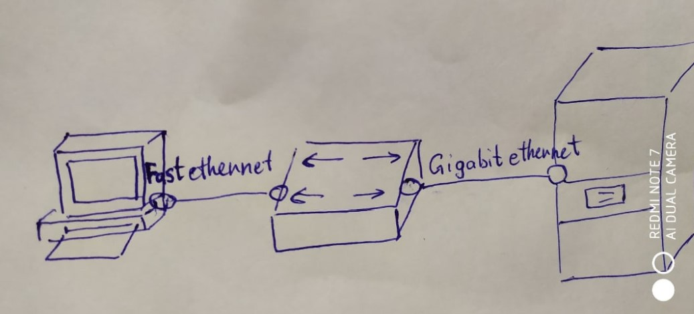
- 25 секунд
- **4 минуты**
- 4 минуты 25 секунд
- 6 минут 15 секунд
- 10 минут

## С помощью чего взаимодействуют 2 почтовых агента MTA?
- буфер
- почтовый агент MDA
- почтовый сервер
- почтовый ящик
- **ни один из ответов (SMTP)**

## Control frames WiFi
- **ACK**
- **CTS**
- DTR
- NACK
- RXD
- TXD

## Какие варианты замены позволяют восстановить пакет, последовательность 11000011?
- **1100 -> 11001**
- **1100001 -> 11000011**
- 110001 -> 1000001
- 11000011 -> 1100000
- 11000011 -> 11000010
- 11000011 -> 110000101

## Какие из топологий ориентированы на кольцевые физические топологии?
- ADSL
- Ethernet
- **FDDI**
- Token Bus
- **Token Ring**
- WiMax

## Какой уровень модели OSI принято считать уровнем сопряжений между программным и аппаратным обеспечением компьютерных сетей?
- Прикладной
- Сетевой
- **Транспортный**
- Физический
- Ни один

## При ARP-запросе, в каких полях содержатся MAC-адрес и IP-адрес станции, сгенерировавшей этот запрос?
- Hrd
- Pro
- **SHA**
- **SPA**
- THA
- TPA

## Какие флаги являются значимыми при закрытии TCP-соединения?
- **ACK**
- **FIN**
- RST
- SYN
- Time-out
- W

## Какие из перечисленных оптоволоконных разъемов наиболее компактные?
- Bionic
- **E - 2000**
- FC
- **LC**
- SC
- ST

## Блочные коды Ethernet
- 3b
- **4b/5b**
- 5b/4b
- 6b/7b
- 6b/8b
- **8b/10b**

## Что значит collaboration в компьютерных сетях?
 - Методика оценки производительности
 - Пересылка больших файлов
 - Разновидность спама
 - **Совместная разработка чего-либо**
 - Ни один из вышеперечисленных

## Картинка витой пары (бело-оранжевый, оранжевый, бело-зеленый, синий, бело-синий, зеленый, бело-коричневый)
- TIA-568-A
- **TIA-568-B**
- TIA-568-F
- USOC
- Нестандартная обжимка

## Какое поле в кадре Ethernet самое длинное?
- **Данные**
- Контрольная сумма
- Преамбула
- Расширитель
- Ни один из ответов

## Какие корпоративные системы электронной почты можете назвать?
- **Exchange**
- Gmail
- **GroupWise**
- PowerPoint
- VisualStudio
- Webex

## Для чего нужен HeadChecksum в IPv4?
- Для "подгона" контрольной суммы заголовка к 0
- Выравнивания заголовка по октетам
- **Проверки целостности заголовка**
- Проверка целостности пакета
- Ничего

## Какую физическую топологию образует сеть ATC?
- Bus
- Full-mesh
- **Hub-and-spokes**
- Mesh
- P2P

## Какая запись о ресурсах DNS является практически используемой альтернативной запросу IQUERY (об обратном преобразовании)?
- A
- HINFO
- ID
- IQ
- **PTR**

## Устройства посредники для сегментов ЛКС:
- IP-телефоны
- **Модемы**
- Мультиплексоры
- Оконечные концентраторы
- **Точки доступа**
- Файловые серверы

## Чем чревато включение поддержки раннего освобождения маркета в Token Ring?
- Возможным наличием более одного маркера одновременно
- **Возможным наличием более одного кадра одновременно**
- Изменением формата кадров
- Отсутсвием необходимости в резервной станции-мониторе
- Ошибок из-за несовместимости
- **Увеличением средней производительности**

## Сколько проводов необходимо для соединения двую com портов в дуплексном режиме?
- 1
- 2
- **3**
- 4
- 5

## В RS232 какие регистры используются как буферы при вводе данных?
- **THR**
- **RBR**
- LCR
- MCR
- MSR
- FCR

## Закодировать кодом Миллера (картинки) 10100110
- **1**
- 2
- 3
- 4
- 5

## TCP. Найти AN (fast retransmit)
- 11
- 141
- 151
- **181**
- Ни один

## Какие протоколы предназначены для транзакции потокового видео?
- **HLS**
- HTTPS
- IRC
- NTP
- **RTMP**
- SMTP

## Какими первичными характеристиками обладат гармоника (гармоническое колебание)?
- **Амплитуда**
- Гармоничность
- Длительность
- Скорость
- **Частота**
- Ширина

## Чем Cisco UPOE отличается от стандартных реализаций PoE?
- **Количеством используемых витых пар**
- Количеством устройств-потребителей
- **Максимальной допустимой мощностью**
- Максимальным допустимым напряжением
- Минимальным потребляемым током
- Топологией

# 750502
## Какой порт будет задействован?
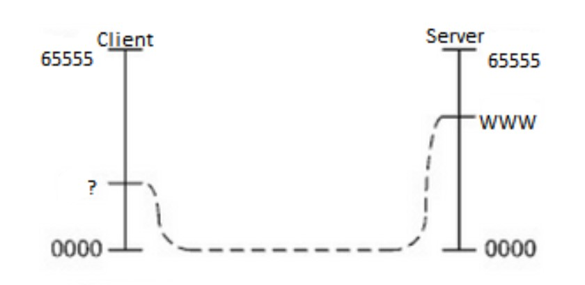
- 25
- **80**
- 1024
- 8080
- 60532

## Фото кабеля
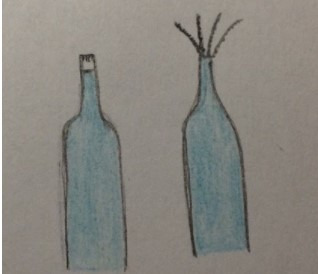
- **Патч-корд**
- **Плоский кабель, четырехжильный**
- XXX
- XXX
- XXX
- XXX

## Что может быть использовано на месте CFWS?
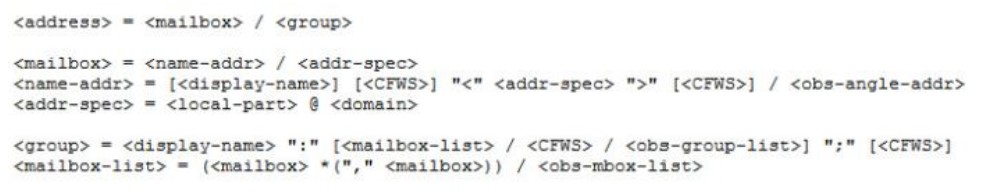
- 192.168.11.1
- From
- Kafedra EVM
- user@domain.by
- **Несколько пробелов**

## Что делает передатчик Ethernet после передачи (в канал) очередного кадра?
- Вычисляет случайную задержку
- Инерементирует счетчик попыток
- Передает -сигнал
- Проверяет занятость канала
- Ни один из вышеперечисленных вариантов

## Какие технологии ориентированы на шинные физические топологии?
- CDDI
- FDDI
- Fast Ethernet
- **Token Bus**
- Token Ring
- **Xerox Ethernet**

## Какой механизм Token Ring обеспечивают то, что станция может передать кадр?
- Система приоритетов
- Автопереконфигурирование
- **Ограничение времени владением маркером**
- Наличие станции монитора
- Ни один из вышеперечисленных

## На каких уровнях модели OSI вместо "пакетов..." говорят о "сегментах"?
- L1
- L2
- L3
- **L4**
- **L5**
- L8

## Гарантии доставки данных TCP/IP
- **Защита при транспартировке**
- Дублирование всех данных
- Невозможность потери данных между посредниками
- **Подтверждение передачи данных**
- Упорядочивание данных в соответствсии с очередью приема
- И упорядочивание данных в стек...

## Какие утверждения правильны в отношении почтовых протоколов?
- Имеется возможность широковещательного оповещения посредством одинакового IP
- Прямо перед отправкой сообщения оно оцифровывается почтовыми агентом
- Конкретное сообщение отправляется по всей СПД по одному конкретному протоколу
- **Сообщения по умолчанию отправляются в режиме "best effort"**
- **Электронное сообщение это пример сообщения прикладного уровня**
- Электронное сообщение это специальный файл

## С помощью чего в IPv6 поддерживается фрагментация?
- QoS
- Набора флагов
- Общей маршрутизации
- **Сегментного заголовка**
- Маршрутизации нет

## Какие высказывания о www.bsuir.by правдивы?
- Доменное название DNS-домена
- **Доменное название DNS-зоны**
- Доменное название TLD
- Доменное название авторского DNS-сервера
- **Доменное название состоит из нескольких меток**
- XXX

## С чем нужно соединить RTS на противоположной стороне для создания кросс-кабеля?
- **CTS**
- RTS
- XXX
- **XXX**
- XXX

## Понятие chat в КС
- Обмен аудио
- Обмен видео
- **Обмен текстовыми сообщениями**
- Обмен файлами
- Ничего из вышеперчисленного

## Какие поля в кадре Token Ring может модифицировать пользовательская станция?
- Адрес источника
- **Бит монитора**
- Данные
- Запрашиваемый уровень приоритета
- Контрольная сумма
- **Флаг копирования кадра**

## Выберите из списка тип документа
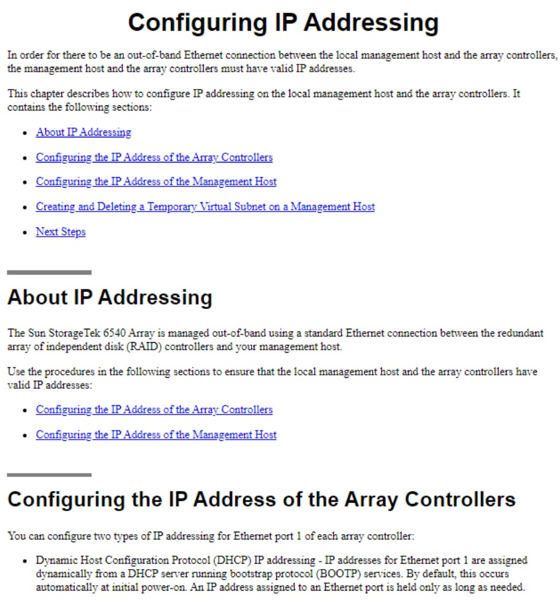
- Command Reference
- **Config guide**
- Data Sheet
- Users Manual
- White Paper

## Выбрать термины, подходящие для p2p сетей
- Идентификатор
- **Пир**
- Сервер
- **Сид**
- Трек
- Флаг

## Что охватывает контур рабочего заземления?
- **Заземленные провода, замурованные в стены**
- Металлические рукава системы вентиляции
- Металлические трубы где-то там
- Металлический каркас здания
- **Пластинка в силовом щите**
- Радиаторы системы отопления

## Чему равен SN?
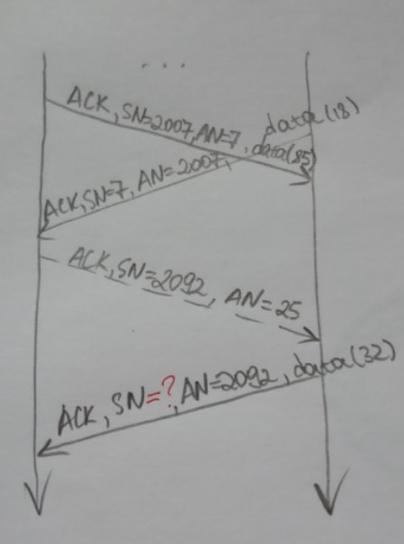
- 7
- **25**
- 92
- 2092
- Ни один

## Какому уровню модели OSI соответствует ЦОД?
- Интерфейсный
- Канальный
- Прикладной
- Специальный
- **Всем**

## Основная характеристика коаксиального кабеля
- **Волновое сопротивление**
- Категория
- Количество жил
- Степень экранирования
- Нет правильных вариантов

## ГКС против ЛКС
- **В ГКС используется аппаратура, которой в ЛКС не встретишь**
- ГКС, в отличии от ЛКС открыты для прослушивания
- В сегментах ГКС расстояние ограничено
- **Пропускная способность ГКС значительно больше, чем пропускная способность ЛКС**
- В общем, ГКС состоит из последовательно соединенных ЛКС
- ГКС - адаптированные к большей площади технологии ЛКС

## Свойства кода Хэмминга
- **Блочный**
- Групповой
- Модульный
- Нелинейный
- **Систематический**
- Циклический

## Уровень '1' в 16550
- -9В
- -1В
- 0В
- **5В**
- 9В

## Какие порты ввода-вывода зарезарвированы для COM-портов?
- 70h
- 170h
- **2F8h**
- 278h
- 378h
- **3F8h**

## Ключевые понятия сетевого уровня OSI
- Диспетчеризация сетевых процессов
- Коммутация
- Контроль логических соединений
- **Маршрутизация**
- XXX
- XXX

## Чем является PDU сетевого уровня OSI?
- Кадром канального уровня
- Пакетом сетевого уровня
- Пакетом транспортного уровня
- XXX
- **Относится ко всему вышеперечисленному**

## Найти топологию сети
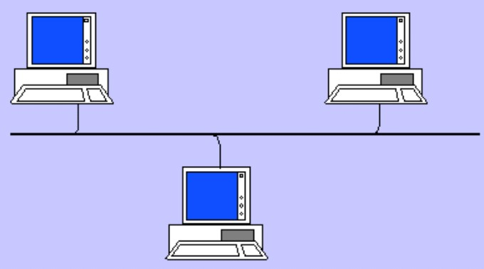
- **Шина**
- Дерево
- Полносвязное дерево
- Несколько
- XXX

# 750503
## Для чего нужен Flow control в UART 16550?
- **Для фиксирования скорости**
- Для синхронизации
- Для ускорения
- Обойтись без модема
- Подключить несколько приемников

## Где находится этот com1 порт?
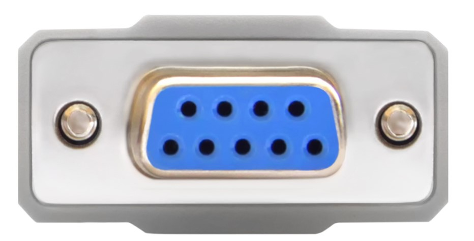
- Это не com1, а com2
- **Находится на АПД**
- Находится в ПК
- Может быть только один
- Является популярным для передачи аналогового сигнала
- Находится на ООД
Второй ответ хз

## Между какими уровнями OSI проходит граница, которая в "первом приближении" разделяет оборудование и программное обеспечение?
- Application-Network
- Application-Physical
- Datalin-Physical
- **Network-Datalink**
- Transport-Network

## Какие поля есть в Token Ring кадре и маркере?
- **AC**
- **SD**
- DA
- FCS
- XXX
- XXX

## С какой целью в MAC включен OUI?
- Для уникальности адресов
- **Для обозначения производителя**
- XXX
- XXX
- XXX

## Из представленных программ выберете Instant Messengers
- Apple Store
- **IRC**
- **Skype**
- Outlook
- Word
- Visual Studio

## Какие доменные наименования допустимы?
- w-w-w.bsuir.by
- .www.bsuir.by
- 10(result).bsuir.by
- **bsuir.by**
- **www.bsuir.by.**
- https//bsuir.by

## Что за кабель?

- **Качественный кабель (с сеткой)**
- Повышенная влагостойкость
- Кроме витых пар есть оптоволокно
- Многожильный 
- Не оконечный
- **Пожаробезопасный**

## При работе в СПД возникает QoS?
- **Голос**
- **Видео**
- Полезные данные
- Служебный трафик
- Спам
- Электронная почта

## У каких Ethernet совпадают логическая и физическая топология?
- **Xerox**
- **10BASE2**
- 100BASE-T2
- 100BASE-TX
- 1000BASE-T
- 10GBASE-T

## Согласно стандарту Token Ring, где хранится информация о старом уровне приоритета в кольце?
- В кадре
- В маркере
- XXX
- **В стековой станции**
- XXX

## Сколько кабелей нужно для подключения питания PoE PD?
- 0
- **1**
- 2
- 3
- Не нужен кабель

## Сколько в 5 метрах футов?
- 0.5
- 5
- 15
- 30
- 45

## Какие утверждения верны для перемежения?
- **Это сугобо аппаратная...**
- Пакет можно передавать без флага начала
- Применимо лишь в ЛКС
- Применимо только для передачи в реальном масштабе времени
- **Совместимо с фрагментированием**
- Широко используется в проводных средах

## Какой канальный код используется при передаче между com-портами?
- **NRZ Level Bipolar**
- NRZ Level Unipolar
- RZ Inverted Unipolar
- RZ Unipolar
- Ни один

## На каких уровнях сетевой модели Cisco не рассматривается подключение пользовательских станций?
- Access
- Borderless
- Collaboration
- **Core**
- **Distribution**
- Link

## В чем измеряется время случайной задержки WiFi?
- Межкадровый интервал
- Минуты
- Кадры
- XXX
- **Другое**

## Какой из почтовых агентов позволяет передавать сообщения между почтовыми серверами?
- **Transport**
- User
- Deliver
- XXX
- XXX

## Какая физическая топология позволяет непосредственную связать друг с другом 4 станции
- **Full Mesh**
- XXX
- XXX
- XXX
- XXX

## Какие множества совместимы с полями Галуа?
- **{0,1}**
- {0,1,2}
- **{0,1,2,3}**
- {0,1,2,3,4}
- {0,1,3,5,7,11}
- {1}

## При каком по счету рукопожатии есть и SYN, и ACK?
- 1
- **2**
- 3
- 4
- другое

## Какие программные порты зарезервированы для электронной почты?
- **25**
- 55
- **110**
- 80
- 21
- 20

## Что происходит со сбойным кадром в Ethernet?
- **Отбрасывается**
- Возвращается отправителю
- Передается на уровень выше для обработки
- XXX
- XXX

## Вопрос по картинке

- p2p
- XXX
- XXX
- XXX
- XXX

## Чего нет в кадре Ethernet?
- **Подзаголовок**
- **Маркер**
- FCS
- XXX
- XXX
- XXX

## Какие помещения входят в состав CKC?
- **Аппаратные**
- **Кроссовые**
- XXX
- XXX
- XXX
- XXX

## 4 стрелки в круге, направленные ??? способом, это обозначение чего?
- Модем
- Коммутатор
- **Маршрутизатор**
- АТС
- XXX

# 750504
## Есть 5 станций, сколько из них могут работать одновременно в широковещательном режиме?
- **1**
- 2
- 3
- 4
- 5

## Какие каналы могут передавать данные в определенный момент времени в одном направлении?
- **Полудуплексные**
- Полнодуплексные
- **Симплексные**
- Мультидуплексные
- Дуплексные
- XXX

## У станции Token Ring есть кадр для передачи с приоритетом 0. Станция приняла чужой кадр (не маркер) с R = 1 и P = 0. Что идет дальше по кольцу?
- Маркер с P = 0 и R = 0
- Свой R = 1 и P = 0
- Свой P = 1 и R = 0
- Чужой P = 0 и R = 0
- Чужой P = 0 и R = 1

## Какие протоколы относят к транспортному уровню сетевой модели TCP/IP?
- ARP
- HTTP
- IP
- IPX
- **TCP**
- **UDP**

## Что позволяет полностью интернационализировать электронную почту?
- Поддержка MIME
- Поддержка MSH
- Поддержка SSL
- **Поддержка Unicode**
- Поддержка проприетарных расширений POP

## Для чего используется полиэтилен в витой паре?
- Гал. Развязк
- Мех повреждения
- Изоляция проводов
- Отделение друг от друга
- Эластичность
- XXX

## С чего начинаеюся взаимодействия через com-порт в синхронном режиме?
- переход на 3ю линию
- Xon
- Start bit
- Stop bit
- Байт синхронизации

## К какому уровню OSI относится PDU?
- Канальный
- Прикладной
- Сети
- Транспортный
- **Ни один**

## Поля в начале пакета
- **SA**
- **DA**
- XXX
- XXX
- XXX
- XXX

## Какие поля лучше располагать в начале пакета (до данных)?
- **DA**
- Extension
- FCS
- Pad
- **SA**
- Status

## Какой логической топологии соответствует хост-терминальная Unix-система?
- Bus
- **Hub-and-spokes**
- Line
- Mesh
- Ring

## Рисунок сегмента одного из оптоволоконных кабелей

- Буфер
- Оболочка
- **Световод**
- Сердцевина
- XXX

## Что учитывается при вычислении случайной задержки согласно WiFi?
- Время ожидания
- Номер беспроводной станции
- Номер фрагмента кадра
- **Окно состязания**
- Системное время

## Какие матрицы используются при линейном помехоустойчивом кодировании?
- Диагональные
- Единичные
- Квадратные
- **Пораждающие**
- **Проверочная**
- Шеннона

## К какой СКС относится кабель, соединяющий рабочее место преподователя с коммутатором в электрическом щитке?
- **Горизонтальная**
- Вертикальная
- Информационная
- XXX
- XXX

## Порты BitTorrent
- **В диапазоне 6881-6889**

## Какие TLDS несовместимы с публичными web-сервисами?
- .by
- .in
- **.invalid**
- .org
- **.localhost**

## Что относится к Ethernet?
- Sequence Number
- Data Offset
- **Carrier Sense**
- Serial Port
- Collision Avoidance
- **Multiple Access**

## Какие компоненты с BNC-разъемами использовали в Ethernet?
- **Barrel**
- Concentrator
- Crimpler
- Splitter
- **T Connector**
- U Connector

## К какому уровню модели OSI следует отнести HTML?
- L1
- L2
- L4
- L6
- **Ни один из названных**

## Какие протоколы выполняют функцию MUA?
- http
- https
- **imap**
- **pop**
- sshs

## КС, которые покрывают наибольшую площадь:
- **WAN**
- **RAS**
- LAN
- Home
- Industrial

# 750505
## Исходя из чего стандартизированны классы PoE?
- Из длинны кабелей
- Из количества кабелей
- Из количества запитываемых устройств
- Из количества запитывающих устройств
- **Из потребляемой мощности**

## Как называют часть буфера TCP, в которую приложение может записать данные, которые TCP процесс передаст незамедлительно?
- Достаточное окно передачи
- Достаточное окно приема
- **Текущее окно передачи**
- Текущее окно приема
- **Эффективное окно передачи**
- Эффективное окно приема

## Картинка с кабелем
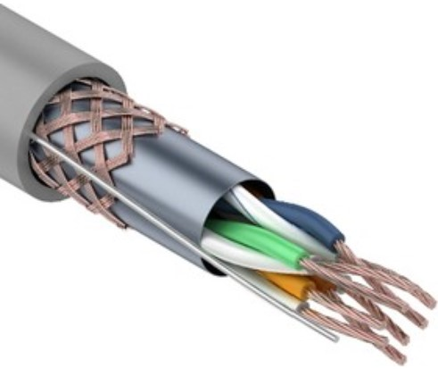
- F/FTP
- S/FTP
- S/UTP
- U/STP
- **Ни один**

## Обратный сигнал для DSR у RS-232
- DCD
- DSR
- **DTR**
- RTS
- Ни один

## Для каких межсоединений следует выбрать обычный (не кроссоверный) патчкорд?
- **Коммутатор, ПК**
- **Коммутатор, маршрутизатор**
- Маршрутизатор, ПК
- Маршрутизатор, маршрутизатор
- Маршрутизатор, ноутбук

## Какие разъемы используют, чтобы связать 2 ПК посредством COM-портов?
- DA-9
- DA-15
- **DB-25**
- BC-37
- DD-30
- **DE-9**

## Какие высказывания о NRZ кодах являются правильными?
- **Некоторые из таковых кодов инверсны друг другу**
- При кодировании можно обойтись без опорного сигнала CLK
- При кодировании одним и тем же коодом может быть задейсованы более 2 логических уровней
- **Это коды без самосинхронизации**
- Это униполярные коды
- Это коды с возвратом к единице

## Какие варианты декапсуляции правильны?
- Ethernet -> UDP
- **Ethernet -> IP**
- HTTP -> UDP
- IP -> HTTP
- **IP -> TCP**
- UDP -> TCP

## Что изображено на рисунке?
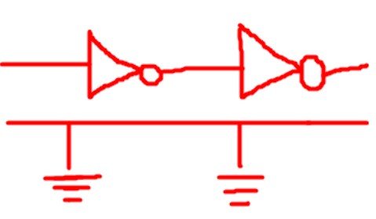
- Дифференциальная пара
- Инвертирующий каскад
- **Нессиметричная электрическая цепь**
- Схема модуляции
- Ни один

## Достоинства СПД с коммутацией каналов в сравнении с СПД с коммутацией пакетов?
- Наличие альтернативных путей
- Наличие виртуальных соединений на канальном уровне
- **Отсутствие необходимости адресовать оконечные устройства**
- Отсутствие необходимости адресовать промежуточные устройства
- **Сохранение порядка каналов при их пересылке**
- Сохранение структуры пакетов

## К какому уровню модели OSI относится IP 192.168.11.2?
- L1
- **L3**
- L5
- L7
- Ни один из указанных

## Подразделением какой компании с 2011 года является Skype?
- Apple
- Intel
- **Microsoft**
- Oracle
- VoIP

## Почему бит-стаффинг лучше подходит к синхронным средствам, а не к асинхронным?
- **В асинхронных средах каждый байт "обращается" синхронно...**
- Программная реализация проще
- Синхронные среды не могут быть байт-ориентированными
- Только синхронные среды соответсвуют топологии "точка к точке"
- Частота синхронизации больше

## Протокол TCP. Чему равно поле AN?

- 15
- 89
- 125
- 1222
- **Ни один из указанных**

## Как кл. администр. предусм. в стр. СКС?
- **В аппаратной**
- В здании
- В кампусе
- **За пределами кампуса**
- XXX
- XXX

## Служебные данные электронного письма
- Data
- **Header**
- Body
- **Envelope**
- Pad
- Trailer

## Что расположено в правой части поля состояния кадра Token Ring?
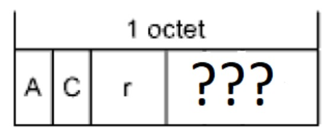
- Копии A, C и r
- XXX
- XXX
- XXX
- XXX

## Компания со штатом 1000 человек. Распологается в нескольких обособленных зданиях. Объединены через VPNs. Есть централизованный доступ к Internet. Какой тип у КС?
- Industrial Network
- *Intranet*
- Isolated Network
- Open Network
- *WAN*

## Помехоустойчивые коды 0001, 0010, 0100. Чему равно кодовое расстояние?
- 0
- 1
- **2**
- 3
- 4

## Что в конечном итоге адресуется в системе электронной почты?
- Почтовые агенты
- Почтовые серверы
- Браузеры пользователей
- ПК пользователей
- **Ничего из вышеперечисленного**

## Для каких целей используют одноранговые сети?
- Для генерации маркера
- **Для пересылки файлов**
- *Для небольших текстовых сообщений*
- Для поиска маршрутов
- Для синхронизации времени

## Физическая топология 1000BASE-SX
- Шина
- **Звезда**
- Point to point
- XXX
- XXX

## Способы обеспечения системы приоритетов при доступе к моноканалу
- **Использование полносвязной топологии**
- **Получение разрешения от станции монитора**
- Частное уплотнение
- Амплитудное уплотнение
- XXX
- XXX

## Полные аналоги ANSI
- EUI
- **TIA**
- **EIA**
- ISO
- XXX
- XXX

## Какие версии ip широко используют?
- ipv1
- ipv2
- ipv3
- **ipv4**
- ipv5
- **ipv6**

# 650501
# 650502
# 650503
# 650504
# 650505
